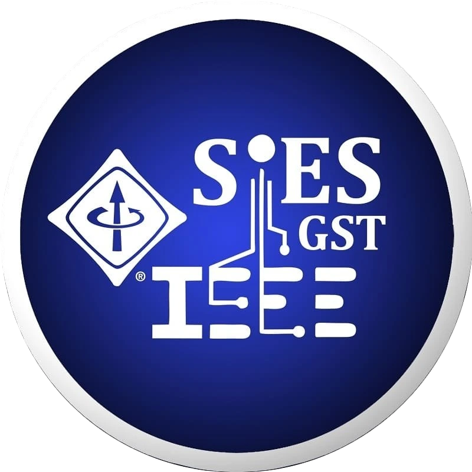

# IEEE SIES GST Website (2026-27)

The official website for the **IEEE Student Branch of SIES Graduate School of Technology**, designed to showcase our events, team, galleries, and achievements for the grand term of 2026-27.



## 🚀 Overview

This project is a modern, responsive, and interactive web application built to represent the technological excellence of our student branch. It features a premium dark-themed UI, smooth animations, and a dynamic gallery interaction system.

## 🛠️ Tech Stack

-   **Framework:** [React](https://react.dev/) (v19)
-   **Build Tool:** [Vite](https://vitejs.dev/)
-   **Styling:** [Tailwind CSS](https://tailwindcss.com/)
-   **Animations:**
    -   [Framer Motion](https://www.framer.com/motion/) (Page transitions & interactions)
    -   [GSAP](https://gsap.com/) (Complex timeline animations)
-   **3D Elements:** [React Three Fiber](https://docs.pmnd.rs/react-three-fiber/) & [Drei](https://github.com/pmndrs/drei)
-   **Routing:** [React Router DOM](https://reactrouter.com/)
-   **Icons:** [Lucide React](https://lucide.dev/)

## 🌟 Key Features

-   **Dynamic Hexagonal Gallery:** A unique honeycomb grid layout for the event gallery that reveals alternative images on hover.
-   **Interactive Timelines & Hero:** Engaging entry animations and scroll-based interactions.
-   **Responsive Design:** Fully optimized for desktops, tablets, and mobile devices.
-   **Performance Optimized:** Fast loading times using lazy loading and optimized assets.

## 📦 Installation & Setup

1.  **Clone the repository**
    ```bash
    git clone https://github.com/GauravPatil2515/ieee-website25-26.git
    cd ieee-website25-26
    ```

2.  **Install dependencies**
    ```bash
    npm install
    ```

3.  **Run the development server**
    ```bash
    npm run dev
    ```

4.  **Build for production**
    ```bash
    npm run build
    ```

## 📂 Project Structure

```
src/
├── assets/          # Images, logos, and static assets
├── components/      # Reusable UI components (Hero, Navbar, EventCard, etc.)
├── loaders/         # Data loaders (e.g., team data)
├── pages/           # Main route pages (Home, Events, Team, Gallery, etc.)
└── Layout/          # Main layout wrapper
```

## 🤝 Contribution

This project is maintained by the **IEEE SIES GST Technical Team**.

## 📄 License

[MIT](LICENSE)
